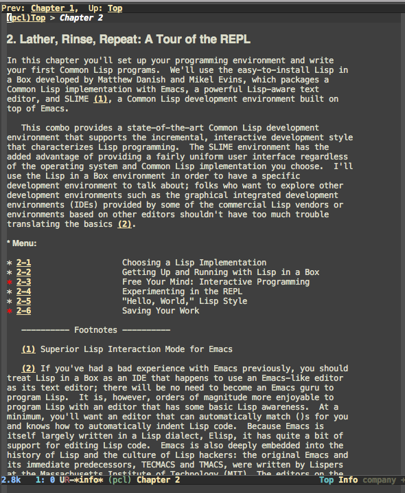

# Practical Common Lisp in Info Format

[Practical Common Lisp](http://gigamonkeys.com/book/) - a great, free Common Lisp resource - typeset for [GNU Texinfo](https://www.gnu.org/software/texinfo/), Emacs' interactive documentation system.

For when you've read enough in your browser to know that you don't want to read it in your browser.

To view in info-reader mode, open `pcl.info` with `C-u C-h i` (just as you would visit a file with `C-x C-f`).

Build from the project root with `$ makeinfo --no-split pcl.texi -o pcl.info`

TODOs:
- [ ] mid-section asides
  - [ ] @node 1-2 Where It Began
    `But I learned Lisp Once, And IT Wasn't Like what you're describing`
  - [ ] @node 8-7 Plugging the Leaks
    `Another classic macro-writing MACRO: ONCE-ONLY`
  - [ ] @node 14-6 Filenames
    `How We Got Here`
  - [ ] @node 15-2 *FEATURES* and Read-Time Conditionalization
    `Packaging the Library`
  - [ ] @node 16-8 Multimethods
    `Multimethods vs. Method Overloading`
  - [ ] @node 17-1 DEFCLASS
    `What Are "User-Defined Classes"?`
  - [ ] @node 19-3 Condition Handlers
    `JAVA-STYLE EXCEPTON HANDLING`
  - [ ] @node 19-6 Other Uses for Conditions
    `Writing Robust Software`
  - [ ] @node 27-1 The Database
    `The Package`
  - [ ] @node 28-2 Song Sources
    `The Package`
  - [ ] @node 29-1 Playlists
    `The Package`
  - [ ] @node 30-3 Character Escaping
    `The Package`
  - [ ] @node 30-6 The Pretty Printer Backend
    `Using Conditions to Have Your Cake and Eat It Too`
- [X] tables
  - [X] Table 6-1.
    `Assignment with = in Other Languages`
  - [X] Table 8-1.
    `Backquote Examples`
  - [X] Table 10-1.
    `Character Comparison Functions`
  - [X] Table 10-2.
    `Literal Strings`
  - [X] Table 10-3.
    `String Comparison Functions`
  - [X] Table 11-1.
    `Basic Sequence Functions`
  - [X] Table 11-2.
    `Standard Sequence Function Keyword Arguments`
  - [X] Table 12-1.
    `Other List Functions`
  - [X] Table 30-1.
    `FOO Output for Self-Evaluating Objects`
- [ ] inline text formatting (bold and italicized)
  - [ ] ...
- [ ] inline inter-chapter links
  - [ ] ...
- [X] images
  - [X] @node 12-1 cons cell diagrams
  - [X] @node 12-2 cons cell diagrams
  - [X] @node 13-1 cons cell diagrams
  - [X] @node 13-3 cons cell diagrams
  - [X] @node 16-3 class hierarchy
  - [X] @node 19-4 more con cells
  - [X] @node 26-1 `Figure 26-1. Sample Web page`
  - [X] @node 26-2 `Figure 26-2. http://localhost:2001/hello.html`
  - [X] @node 26-3 `Figure 26-3. http://localhost:2001/random-number`
  - [X] @node 26-6 `Figure 26-4. http://localhost:2001/show-query-params?foo=bar&baz=10`
  - [X] @node 26-6 `Figure 26-5. http://localhost:2001/simple-form`
  - [X] @node 26-6 `Figure 26-6. Result of submitting the simple form`
  - [X] @node 26-7 `Figure 26-7. http://localhost:2001/show-cookies with no cookies`
  - [X] @node 26-7 `Figure 26-8. http://localhost:2001/set-cookie`
  - [X] @node 26-7 `Figure 26-9. http://localhost:2001/show-cookies after setting a cookie`
- [X] Code blocks and footnotes
  - [X] Chapter 01
  - [X] Chapter 02
  - [X] Chapter 03
  - [X] Chapter 04
  - [X] Chapter 05
  - [X] Chapter 06
  - [X] Chapter 07
  - [X] Chapter 08
  - [X] Chapter 09
  - [X] Chapter 10
  - [X] Chapter 11
  - [X] Chapter 12
  - [X] Chapter 13
  - [X] Chapter 14
  - [X] Chapter 15
  - [X] Chapter 16
  - [X] Chapter 17
  - [X] Chapter 18
  - [X] Chapter 19
  - [X] Chapter 20
  - [X] Chapter 21
  - [X] Chapter 22
  - [X] Chapter 23
  - [X] Chapter 24
  - [X] Chapter 25
  - [X] Chapter 26
  - [X] Chapter 27
  - [X] Chapter 28
  - [X] Chapter 29
  - [X] Chapter 30
  - [X] Chapter 31
  - [X] Chapter 32

@emph for bold

‘Here's how you make green font!’
